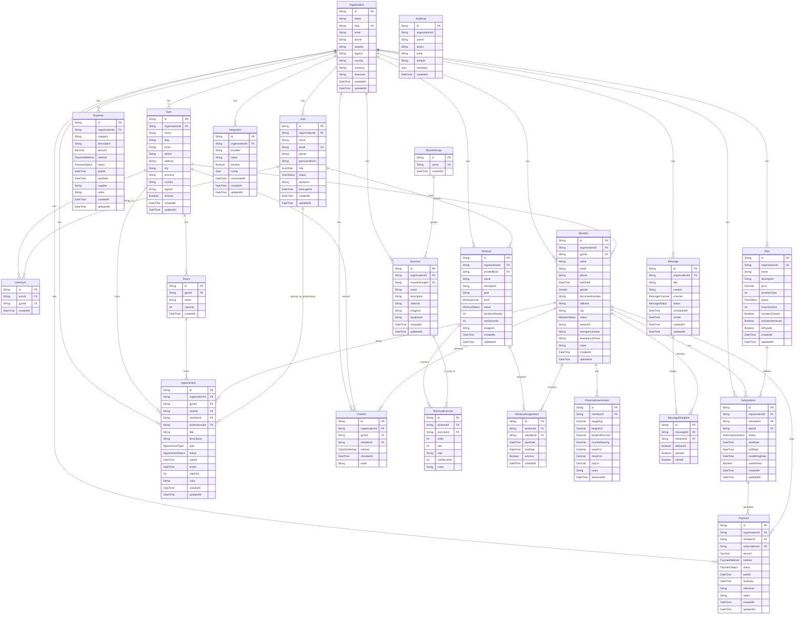

# Diagrama e documentacao do banco de dados

Este documento descreve o modelo de dados do Noogym ERP com base em `prisma/schema.prisma` e na migration inicial `prisma/migrations/20260430131500_init/migration.sql`.

O banco usa PostgreSQL, Prisma ORM e chaves primarias `String` com `uuid()` na maioria das entidades. O modelo e multi-tenant: quase todas as tabelas de negocio possuem `organizationId` para isolar os dados por organizacao.

## Visao geral

Principais dominios modelados:

- Organizacao e unidades: `Organization`, `Gym`, `Room`.
- Usuarios e acesso: `User`, `UserGym`.
- Membros e planos: `Member`, `Plan`, `Subscription`.
- Financeiro: `Payment`, `Expense`.
- Agenda e presenca: `Appointment`, `CheckIn`.
- Treinos: `MuscleGroup`, `Exercise`, `Workout`, `WorkoutExercise`, `WorkoutAssignment`, `PhysicalAssessment`.
- Comunicacao: `Message`, `MessageRecipient`.
- Integracoes e auditoria: `Integration`, `AuditLog`.

## Diagrama ER

## Relacionamentos principais

| Origem | Destino | Campo FK | Cardinalidade | Obrigatorio |
| --- | --- | --- | --- | --- |
| `Gym` | `Organization` | `organizationId` | N:1 | Sim |
| `User` | `Organization` | `organizationId` | N:1 | Sim |
| `UserGym` | `User` | `userId` | N:1 | Sim |
| `UserGym` | `Gym` | `gymId` | N:1 | Sim |
| `Member` | `Organization` | `organizationId` | N:1 | Sim |
| `Member` | `Gym` | `gymId` | N:1 | Nao |
| `Plan` | `Organization` | `organizationId` | N:1 | Sim |
| `Subscription` | `Organization` | `organizationId` | N:1 | Sim |
| `Subscription` | `Member` | `memberId` | N:1 | Sim |
| `Subscription` | `Plan` | `planId` | N:1 | Sim |
| `Payment` | `Organization` | `organizationId` | N:1 | Sim |
| `Payment` | `Member` | `memberId` | N:1 | Nao |
| `Payment` | `Subscription` | `subscriptionId` | N:1 | Nao |
| `Expense` | `Organization` | `organizationId` | N:1 | Sim |
| `Room` | `Gym` | `gymId` | N:1 | Sim |
| `Appointment` | `Organization` | `organizationId` | N:1 | Sim |
| `Appointment` | `Gym` | `gymId` | N:1 | Nao |
| `Appointment` | `Room` | `roomId` | N:1 | Nao |
| `Appointment` | `Member` | `memberId` | N:1 | Nao |
| `Appointment` | `User` | `professionalId` | N:1 | Nao |
| `CheckIn` | `Organization` | `organizationId` | N:1 | Sim |
| `CheckIn` | `Gym` | `gymId` | N:1 | Nao |
| `CheckIn` | `Member` | `memberId` | N:1 | Sim |
| `Exercise` | `Organization` | `organizationId` | N:1 | Sim |
| `Exercise` | `MuscleGroup` | `muscleGroupId` | N:1 | Nao |
| `Workout` | `Organization` | `organizationId` | N:1 | Sim |
| `Workout` | `User` | `createdById` | N:1 | Nao |
| `WorkoutExercise` | `Workout` | `workoutId` | N:1 | Sim |
| `WorkoutExercise` | `Exercise` | `exerciseId` | N:1 | Sim |
| `WorkoutAssignment` | `Workout` | `workoutId` | N:1 | Sim |
| `WorkoutAssignment` | `Member` | `memberId` | N:1 | Sim |
| `PhysicalAssessment` | `Member` | `memberId` | N:1 | Sim |
| `Message` | `Organization` | `organizationId` | N:1 | Sim |
| `MessageRecipient` | `Message` | `messageId` | N:1 | Sim |
| `MessageRecipient` | `Member` | `memberId` | N:1 | Sim |
| `Integration` | `Organization` | `organizationId` | N:1 | Sim |

## Entidades

### Organization

Representa uma organizacao cliente do SaaS. E a raiz do modelo multi-tenant e agrupa unidades, usuarios, membros, planos, assinaturas, pagamentos, despesas, treinos, agenda, check-ins, mensagens e integracoes.

Campos importantes:

- `id`: chave primaria UUID.
- `slug`: identificador unico da organizacao.
- `currency`: moeda padrao, com default `AOA`.
- `timezone`: fuso horario padrao, com default `Africa/Luanda`.

### Gym

Representa uma unidade fisica ou filial da organizacao.

Campos importantes:

- `organizationId`: vinculo obrigatorio com `Organization`.
- `slug`: identificador da unidade dentro do dominio da aplicacao.
- `isActive`: controla se a unidade esta ativa.

Relaciona-se com membros, usuarios por `UserGym`, salas, agenda e check-ins.

### User

Representa um usuario interno da organizacao.

Campos importantes:

- `email`: unico globalmente.
- `role`: perfil RBAC, default `ADMIN`.
- `status`: estado da conta, default `ACTIVE`.
- `passwordHash`: hash da senha, opcional para cenarios de convite ou provedores externos.

Relaciona-se com unidades por `UserGym`, treinos criados e agendamentos onde atua como profissional.

### UserGym

Tabela de associacao entre usuarios e unidades.

Regras:

- `userId` referencia `User`.
- `gymId` referencia `Gym`.
- Possui indice unico composto `userId + gymId`, impedindo duplicidade da mesma associacao.

### Member

Representa um aluno, cliente ou membro da academia.

Campos importantes:

- `organizationId`: escopo tenant obrigatorio.
- `gymId`: unidade principal opcional.
- `status`: estado operacional do membro.
- `gender`: genero informado, default `NOT_INFORMED`.
- Campos de emergencia: `emergencyName`, `emergencyPhone`.

Relaciona-se com assinaturas, pagamentos, check-ins, agendamentos, avaliacoes fisicas, treinos atribuidos e mensagens.

### Plan

Representa um plano comercial vendido aos membros.

Campos importantes:

- `price`: valor decimal com precisao `12,2`.
- `durationDays`: duracao em dias.
- `maxCheckIns`: limite opcional de entradas.
- `includesClasses`: default `true`.
- `includesWorkouts`: default `false`.
- `isPopular`: destaque comercial.

### Subscription

Representa a adesao de um membro a um plano.

Campos importantes:

- `memberId`: membro assinante.
- `planId`: plano contratado.
- `status`: situacao da assinatura.
- `startDate` e `endDate`: periodo de validade.
- `nextBillingDate`: proxima cobranca opcional.
- `autoRenew`: renovacao automatica.

### Payment

Registra receitas e pagamentos feitos por membros ou vinculados a assinaturas.

Campos importantes:

- `amount`: valor decimal com precisao `12,2`.
- `method`: metodo de pagamento.
- `status`: situacao do pagamento, default `PENDING`.
- `paidAt`: data de liquidacao.
- `dueDate`: vencimento.
- `memberId` e `subscriptionId`: ambos opcionais para permitir registros flexiveis.

### Expense

Registra despesas da organizacao.

Campos importantes:

- `category`: categoria financeira.
- `description`: descricao obrigatoria.
- `amount`: valor decimal com precisao `12,2`.
- `method`: metodo de pagamento opcional.
- `status`: default `PAID`.
- `supplier`: fornecedor opcional.

### Room

Representa uma sala, espaco ou local interno de uma unidade.

Campos importantes:

- `gymId`: unidade proprietaria.
- `capacity`: capacidade opcional.

E usada por agendamentos.

### Appointment

Representa eventos de agenda: aulas, personal, avaliacao, reuniao, evento ou outros.

Campos importantes:

- `organizationId`: escopo tenant obrigatorio.
- `gymId`, `roomId`, `memberId`, `professionalId`: vinculos opcionais.
- `type`: tipo de agendamento.
- `status`: default `SCHEDULED`.
- `startAt` e `endAt`: periodo do evento.
- `capacity`: capacidade opcional para aulas ou eventos.
- `color`: cor opcional para calendario.

### CheckIn

Registra a entrada de um membro.

Campos importantes:

- `memberId`: membro que realizou o check-in.
- `gymId`: unidade opcional.
- `method`: QR Code, manual, biometria, app ou NFC.
- `checkedAt`: data/hora, default `now()`.

### MuscleGroup

Catalogo global de grupos musculares.

Campos importantes:

- `name`: unico globalmente.

E referenciado por exercicios.

### Exercise

Representa um exercicio disponivel para montagem de treinos.

Campos importantes:

- `organizationId`: escopo tenant obrigatorio.
- `muscleGroupId`: grupo muscular opcional.
- `videoUrl` e `imageUrl`: midias opcionais.
- `equipment`: equipamento necessario.

### Workout

Representa um treino ou ficha de treino.

Campos importantes:

- `organizationId`: escopo tenant obrigatorio.
- `createdById`: usuario criador opcional.
- `level`: nivel, default `BEGINNER`.
- `status`: estado, default `DRAFT`.
- `durationMinutes` e `restSeconds`: configuracoes opcionais.

Relaciona-se com exercicios por `WorkoutExercise` e com membros por `WorkoutAssignment`.

### WorkoutExercise

Tabela de composicao de treino com exercicios.

Campos importantes:

- `workoutId`: treino.
- `exerciseId`: exercicio.
- `order`: ordem na ficha.
- `sets`, `reps`, `restSeconds`: prescricao.
- Indice unico composto `workoutId + exerciseId + order`.

### WorkoutAssignment

Associa um treino a um membro.

Campos importantes:

- `workoutId`: treino atribuido.
- `memberId`: membro.
- `startDate` e `endDate`: vigencia.
- `isActive`: controla se a atribuicao esta ativa.

### PhysicalAssessment

Registra avaliacoes fisicas de membros.

Campos importantes:

- Medidas corporais opcionais: `weightKg`, `heightCm`, `bodyFatPercent`, `muscleMassKg`, `waistCm`, `chestCm`, `hipCm`.
- `assessedAt`: data da avaliacao.

### Message

Representa uma mensagem preparada, agendada ou enviada.

Campos importantes:

- `channel`: WhatsApp, SMS, e-mail ou push.
- `status`: default `DRAFT`.
- `scheduledAt` e `sentAt`: controle de agendamento/envio.

### MessageRecipient

Tabela de destinatarios das mensagens.

Campos importantes:

- `messageId`: mensagem enviada/agendada.
- `memberId`: destinatario.
- Flags de acompanhamento: `delivered`, `opened`, `clicked`.
- Indice unico composto `messageId + memberId`.

### Integration

Representa integracoes externas configuradas por organizacao.

Campos importantes:

- `provider`: provedor externo.
- `name`: nome amigavel.
- `isActive`: controla ativacao.
- `config`: configuracao JSON.
- `connectedAt`: data da conexao.
- Indice unico composto `organizationId + provider`.

### AuditLog

Registra auditoria de operacoes.

Campos importantes:

- `organizationId`: escopo da auditoria, opcional.
- `userId`: usuario responsavel, opcional.
- `action`: acao executada.
- `entity` e `entityId`: entidade afetada.
- `metadata`: detalhes adicionais em JSON.

Observacao: no schema atual, `AuditLog.organizationId` e `AuditLog.userId` nao possuem foreign keys declaradas. Eles funcionam como referencias logicas.

## Indices e unicidade

| Tabela | Indice unico | Finalidade |
| --- | --- | --- |
| `Organization` | `slug` | Evita duas organizacoes com o mesmo identificador publico. |
| `User` | `email` | Evita usuarios duplicados por e-mail. |
| `UserGym` | `userId, gymId` | Evita associacao repetida entre usuario e unidade. |
| `MuscleGroup` | `name` | Evita grupos musculares duplicados. |
| `WorkoutExercise` | `workoutId, exerciseId, order` | Evita duplicidade de exercicio na mesma posicao do treino. |
| `MessageRecipient` | `messageId, memberId` | Evita destinatario repetido na mesma mensagem. |
| `Integration` | `organizationId, provider` | Permite apenas uma configuracao por provedor em cada organizacao. |

## Enums

| Enum | Valores |
| --- | --- |
| `UserRole` | `SUPER_ADMIN`, `OWNER`, `ADMIN`, `MANAGER`, `TRAINER`, `RECEPTIONIST`, `FINANCE`, `NUTRITIONIST` |
| `UserStatus` | `ACTIVE`, `INACTIVE`, `INVITED`, `SUSPENDED` |
| `MemberStatus` | `ACTIVE`, `INACTIVE`, `OVERDUE`, `BLOCKED`, `CANCELLED` |
| `PlanStatus` | `ACTIVE`, `INACTIVE` |
| `SubscriptionStatus` | `ACTIVE`, `PAUSED`, `OVERDUE`, `CANCELLED`, `EXPIRED` |
| `PaymentStatus` | `PENDING`, `PAID`, `FAILED`, `CANCELLED`, `REFUNDED` |
| `PaymentMethod` | `CASH`, `BANK_TRANSFER`, `CARD`, `MULTICAIXA`, `PIX`, `DIRECT_DEBIT`, `OTHER` |
| `TransactionType` | `INCOME`, `EXPENSE` |
| `AppointmentType` | `CLASS`, `PERSONAL`, `ASSESSMENT`, `MEETING`, `EVENT`, `OTHER` |
| `AppointmentStatus` | `SCHEDULED`, `COMPLETED`, `CANCELLED`, `NO_SHOW` |
| `CheckInMethod` | `QR_CODE`, `MANUAL`, `BIOMETRIC`, `APP`, `NFC` |
| `MessageChannel` | `WHATSAPP`, `SMS`, `EMAIL`, `PUSH` |
| `MessageStatus` | `DRAFT`, `SCHEDULED`, `SENT`, `FAILED` |
| `WorkoutLevel` | `BEGINNER`, `INTERMEDIATE`, `ADVANCED` |
| `WorkoutStatus` | `ACTIVE`, `PAUSED`, `DRAFT`, `ARCHIVED` |
| `Gender` | `MALE`, `FEMALE`, `OTHER`, `NOT_INFORMED` |

Observacao: `TransactionType` existe no schema, mas nao esta ligado a nenhum model na versao atual.

## Regras estruturais

- `Organization` e a raiz principal do tenant.
- `Gym` permite dividir uma organizacao em varias unidades.
- `UserGym` modela acesso do usuario a uma ou mais unidades.
- `Member.gymId`, `Appointment.gymId`, `Appointment.roomId`, `Appointment.memberId`, `Appointment.professionalId`, `CheckIn.gymId`, `Exercise.muscleGroupId`, `Workout.createdById`, `Payment.memberId` e `Payment.subscriptionId` sao relacionamentos opcionais.
- A maioria das relacoes obrigatorias usa `ON DELETE RESTRICT`, evitando exclusoes que deixariam registros dependentes inconsistentes.
- Relacoes opcionais na migration usam `ON DELETE SET NULL`, preservando o historico quando o registro relacionado e removido.
- Campos `createdAt` usam `now()`/`CURRENT_TIMESTAMP`; campos `updatedAt` sao atualizados pelo Prisma com `@updatedAt`.

## Observacoes para manutencao

- Ao adicionar uma nova entidade de negocio, incluir `organizationId` quando os dados pertencerem a uma organizacao.
- Ao criar novas associacoes muitos-para-muitos, preferir uma tabela explicita como `UserGym`, `WorkoutExercise` ou `MessageRecipient`.
- Ao criar novos fluxos auditaveis, registrar a entidade e o identificador afetado em `AuditLog`.
- Ao alterar cardinalidade ou opcionalidade no Prisma, atualizar este documento e gerar uma nova migration.
